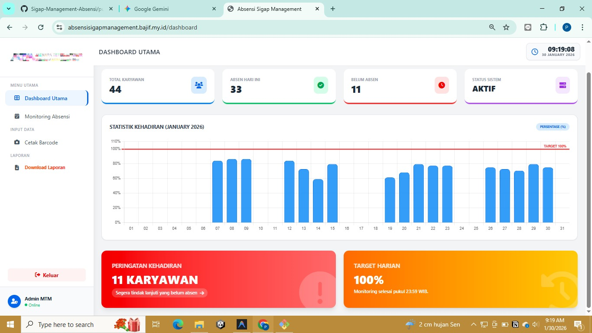
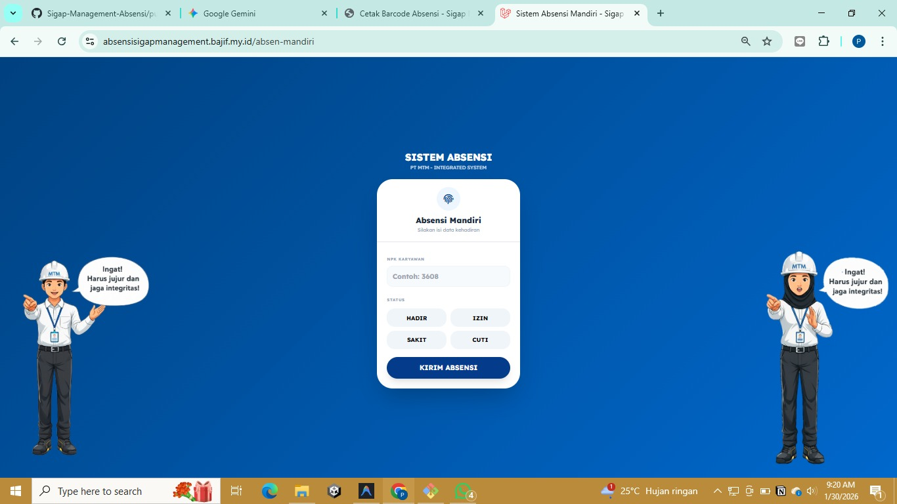
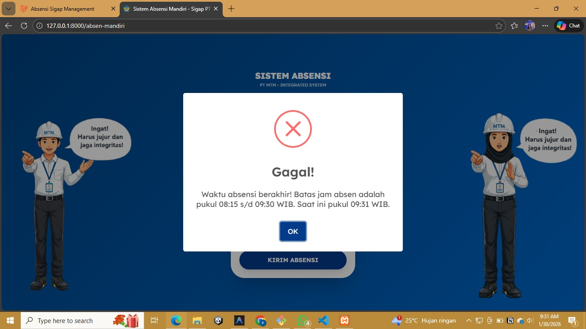
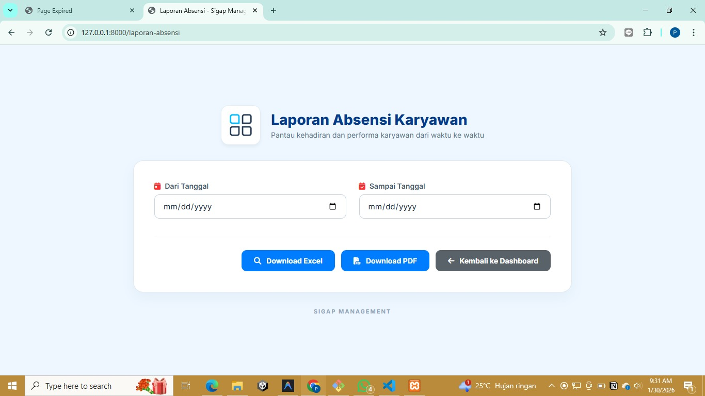

# **SIGAP PT MTM - Integrated Digital Attendance System**

**SIGAP PT MTM** adalah sistem manajemen kehadiran berbasis web yang dirancang untuk mengotomatisasi pendataan karyawan secara *real-time*. Proyek ini berfokus pada pengalaman pengguna seluler (*mobile-first*) dan integritas data melalui validasi sistem yang ketat.

---

## **📂 Dokumentasi Visual Sistem**

### **1. Dashboard Monitoring & Statistik**

Menampilkan visualisasi data kehadiran harian secara otomatis. Membantu manajemen memantau persentase kehadiran seluruh karyawan melalui grafik yang intuitif.

### **2. Antarmuka Mobile (Absensi Mandiri)**

Didesain khusus untuk layar smartphone dengan prinsip *Responsive Web Design*. Mengedepankan kemudahan navigasi bagi karyawan di lapangan.

### **3. Sistem Validasi & Notifikasi**

Mengintegrasikan **SweetAlert2** untuk memberikan *feedback* instan kepada pengguna. Sistem akan menolak absensi jika di luar jam operasional atau jika terjadi duplikasi data.

### **4. Laporan Grid & Monitoring**

Tabel monitoring bulanan yang mendetail, menyajikan status kehadiran dan jam masuk yang diambil secara akurat dari database.

---

## **1. Fitur Utama & Solusi Teknis**

* **Mobile-First Optimization**: Layout kartu absensi disesuaikan secara presisi agar elemen visual tetap terlihat utuh di berbagai ukuran layar smartphone.
* **Server-Side Time Validation**: Pembatasan jam absen dikunci di sisi *back-end* (Controller) menggunakan zona waktu `Asia/Jakarta` untuk mencegah manipulasi waktu oleh pengguna.
* **Automated Statistics**: Penghitungan otomatis status Hadir, Sakit, Izin, Cuti, dan Alpa untuk laporan harian yang akurat.
* **Multi-Format Export**: Kemampuan untuk mengekspor rekapitulasi kehadiran ke dalam format **Excel** dan **PDF** untuk keperluan administrasi formal.

## **2.Teknologi (Tech Stack)**

* **Framework**: Laravel (PHP).
* **UI/UX**: Tailwind CSS & Lexend Fonts.
* **Database**: MySQL (Manajemen relasi Karyawan dan Absensi).
* **Library**: SweetAlert2 (Notifikasi), Maatwebsite Excel, Barryvdh DomPDF.

---

### **Instalasi Cepat**

1. `git clone
2. `composer install`
3. `cp .env.example .env`
4. `php artisan migrate --seed`
5. `php artisan serve`

© 2026 PT MTM • DIGITAL SYSTEM
